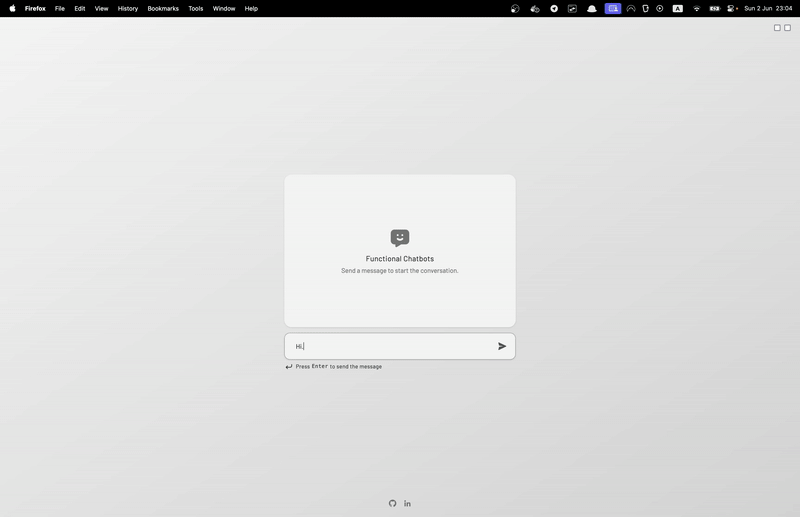
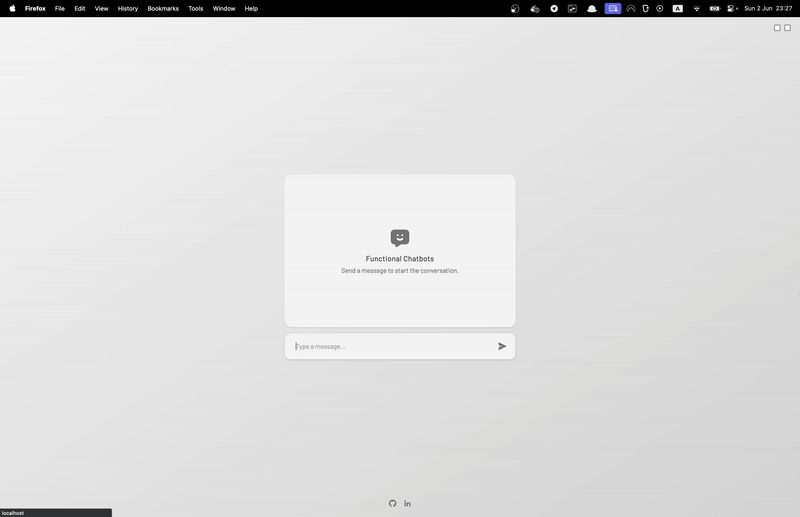
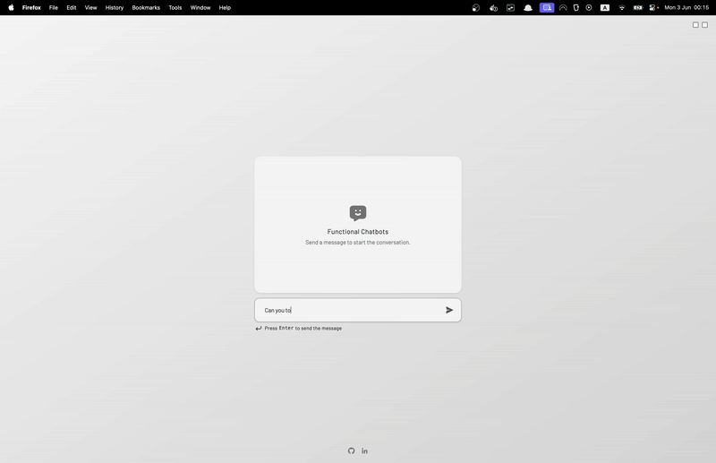
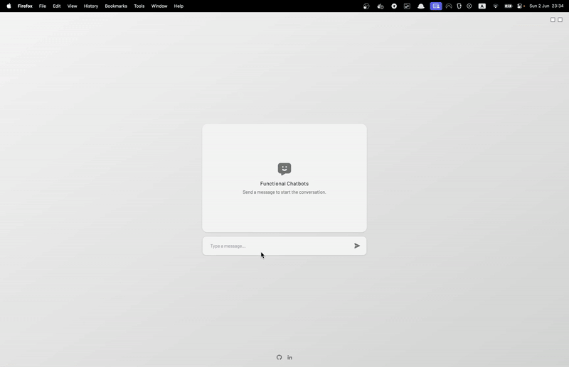

## Progress

Follow the progress table below to see the different milestones / branches for this workshop.

| Branch                      | Status | Type | Description                                              |
|-----------------------------|--------|------|----------------------------------------------------------|
| `0-start-here`              | ✅      | Start | Set up the project, get familiar with the codebase.      |
| `1-integrate-llm-task`      | ✅      | Task | Integrate the LLM within the htmx chat.                  |
| `2-integrate-llm-solution`  | ✅      | Solution |                                                          |
| `3-client-events-task`      | ✅      | Task | Enable the LLM to trigger dark mode & fullscreen mode. |
| `4-client-events-solution`  | ⏳      | **Solution** |                                                          |
| `5-server-actions-task`     | ⏭      | Task | Enable the LLM to create, update, and delete pizza orders. |
| `6-server-actions-solution` | ⏭      | Solution |                                                          |

To switch to another branch, use `git switch`.

---

**Congratulations** on completing the `3-client-events-task` branch! 🎉

The assistant is now able to toggle dark & fullscreen mode.

Maybe you noticed some weird behaviours from the assistant while implementing this task (or maybe not). 

Let's discuss that.

---

### Problem: LLM Behaving Like a Kid with a New Toy

Telling the assistant it can trigger client events is like putting a kid in front of a **"Do not press"** button. 🤣


It rarely resists from toggling a state or two.

**Assistant toggling states impulsively:**



### Solutions: Reasoning & Confirmation

#### Solution 1: Reasoning
I've tried multiple ways to tame it.

A clear system prompt makes a **big** difference.

Another thing that helped was including an internal `reasoning` process for the assistant. 

This is nothing new in prompt engineering. It's a way to make the assistant "think" before it acts.

**Assistant reasoning before toggling states:**


It's answers become much more thoughtful and less impulsive.

#### Solution 2: Confirmation

Enforcing a `confirmation` step before triggering any event also helped avoid accidental triggers.

**Assistant asking for confirmation:**


However, I don't like having to confirm every single action. This would ideally be implemented only for critical actions (like delete).

### Problem: Race Conditions (I think?)

When the assistant triggers both `toggleDarkMode` & `toggleFullscreenMode` simultaneously, the results are unpredictable:
- Both actions may execute.
- Only one action may execute.
- Neither action may execute.

**States working abnormally without delay:**


I initially blamed the assistant's impulsive behavior, but it wasn't the cause.

Adding the `delay` modifier to one of the checkbox toggles' `hx-trigger` attribute solved it.

I'd argue this delay also enhances the experience.

**States working correctly with delay:**


There were many interesting learnings from this task. 

Let's move on to **server actions**.

---

# Next Steps

Switch to the `5-server-actions-task` branch to see the next task.
```bash
git switch 5-server-actions-task
```