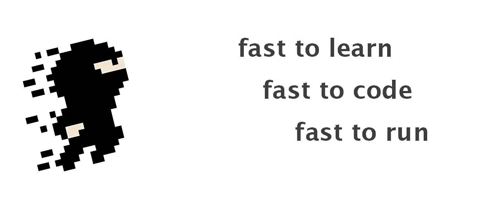
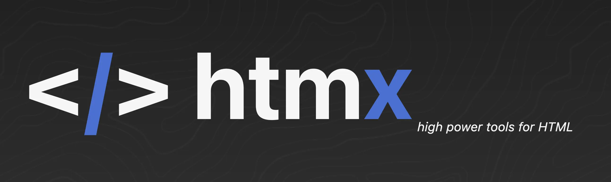
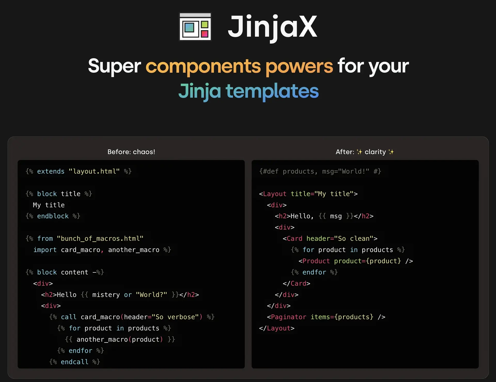
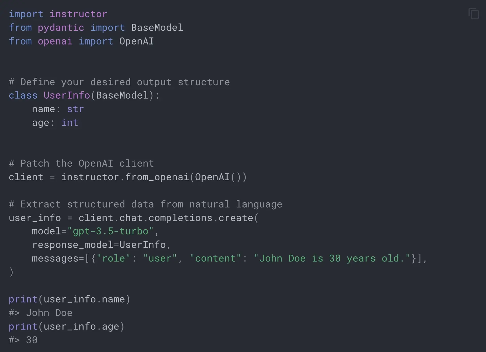

# Functional LLM Chatbots - DjangoCon Europe 2024

**Welcome to my workshop!** Today we're building this:


## Project Milestones

Follow the progress table below to see the different milestones / branches for this workshop.

| Branch                      | Status      | Type     | Description                                                          |
|-----------------------------|-------------|----------|----------------------------------------------------------------------|
| `0-start-here`              | ⏳           | **Start**    | **Set up the project, get familiar with the codebase.** |
| `1-integrate-llm-task`      | ⏭           | Task     | Integrate the LLM within the htmx chat.                              |
| `2-integrate-llm-solution`  | ⏭           | Solution |                                                                      |
| `3-client-events-task`      | ⏭           | Task     | Enable the LLM to trigger dark mode & fullscreen mode.               |
| `4-client-events-solution`  | ⏭           | Solution |                                                                      |
| `5-server-actions-task`     | ⏭           | Task     | Enable the LLM to create, update, and delete pizza orders.           |
| `6-server-actions-solution` | ⏭           | Solution |                                                                      |

To switch to another branch, use `git switch` (e.g. `git switch 1-integrate-llm-task`).

Each branch includes a `TODO.md` file with instructions on what to do next.

# Requirements

### Tools

- [Git](https://git-scm.com/downloads)
- [Docker Desktop](https://www.docker.com/products/docker-desktop/)
- [Python (if not using Docker)](https://www.python.org/downloads/)
- GroqCloud [account](https://console.groq.com/login) and [API key](https://console.groq.com/keys) (Free access to LLama 3)

### Knowledge

This workshop will be easier for you if you're familiar with:
- Django
- HTMX
- OpenAI's API
- TailwindCSS

I tried to keep things simple, but there are lots to cover in only 50 minutes.

# Getting Started

1. Clone the repository:
    ```
    git clone https://github.com/scriptogre/functional-chatbots.git
    ```
2. Rename `.env.example` to `.env`
3. Update `GROQ_API_KEY` with your GroqCloud API key 
4. Run `docker compose up` to start the project
5. Open browser at `http://localhost:8000`

# Project Structure

**Warning:** This project is unconventional. Enjoy the ride!

# Django-Ninja

<a href="https://django-ninja.dev/">
    
</a>

> Wait, what?! You want to render templates with Django-Ninja?

### Why Django-Ninja?

Why not?

1. **It's less verbose**, with intuitive syntax inspired by FastAPI.
2. **It's more performant**, thanks to being  built on top of Starlette.
3. **It's still Django**, so we can benefit from the included batteries when needed.

Besides, it uses **Pydantic**.

[Instructor](https://python.useinstructor.com/) also uses Pydantic. This will come in handy later.

# htmx

<a href="https://htmx.org">
    
</a>

> Grug from [The Grug Brained Developer](https://grugbrain.dev/) by Carson Gross (creator of [htmx](https://htmx.org/)). Love the article.

We'll use [htmx](https://htmx.org/) to easily add interactivity to our project, like updating chat messages, or
creating/updating/deleting pizza orders - without writing any JavaScript.

### Why htmx?

<a href="https://grugbrain.dev/">
    
</a>

complexity _bad_

# JinjaX

<a href="https://jinjax.scaletti.dev/">  
    
</a>

We'll use [JinjaX](https://jinjax.scaletti.dev/) in our templates, an experimental project that's essentially Jinja2 with JSX-like syntax for components.

### Why JinjaX?

Because paired with htmx, we can do stuff like:

```html  
<ChatContainer
        hx-get="/chat-messages"
        hx-trigger="chatMessagesUpdated from:body"
>
   <ChatMessage role="user">
      I personally love the simplicity of templates with JinjaX.
   </ChatMessage>
</ChatContainer>  
```

Which is a joy to read and write.

Most importantly, it enables keeping **behaviour** (`hx-*` attributes) explicit, while abstracting **structure**.

I've written a [blog about JinjaX](https://tanulchristian.dev/blogs/will_jinjax_replace_django_templates), if you're curious.

<a href="https://tanulchristian.dev/blogs/will_jinjax_replace_django_templates">  
      
</a>  

Similar projects include:
- [`django-components`](https://github.com/EmilStenstrom/django-components/)
- [`slippers`](https://github.com/mixxorz/slippers)
- [`django-template-partials`](https://github.com/carltongibson/django-template-partials) _(Hi Carlton! Love your projects 💚)_

# TailwindCSS

<a href="https://tailwindcss.com/">  
    
</a>

We'll use TailwindCSS for styling.

### Why TailwindCSS?

Because paired with JinjaX, we can do stuff like:
```html
<ChatContainer class="group">

   ...

   <ChatPlaceholder class="group-has-[.chat-message]:hidden" />

</ChatContainer>
```

Which is very expressive. 

We can hide classes that are part of the component, while keeping context-specific classes visible.

By creating custom variants (like `hover:` or `dark:`), we can also do stuff like this:
```html
<!-- This shows only when assistant generates responses -->
<ChatMessage class="hidden htmx-request-on-[#trigger-assistant]:block">
   Typing...
</ChatMessage>
```

You can now add a lot of interactivity with CSS that used to need JavaScript, but it's not always easy.

TailwindCSS makes it simple.

| Tools              | Less JavaScript |
|--------------------|-----------------|
| htmx               | 80%             |
| htmx + TailwindCSS | 99%             |

# GroqCloud API

<a href="https://www.groq.com/">  
      
</a>  

We'll use **GroqCloud**'s free API to interact with **LLama 3 70B**, an open-source model.

### Why GroqCloud?

#### It's **FAST**.

Faster than any other LLM API I've used.

#### It's **FREE**.

Other services like OpenAI, Anthropic, or Google Gemini were paid. I didn't want you to pay for a workshop.

#### It's ENOUGH for our needs.
Their free tier offers **30 requests per minute**. That's 1 request every 2 seconds.

# Instructor

<a href="https://python.useinstructor.com/">  
   
</a>

Instructor is a Python library that does the heavy lifting for getting structured responses from LLMs.

### Why Instructor?

We can use it with Groq's API and it saves us from writing a lot of code.
