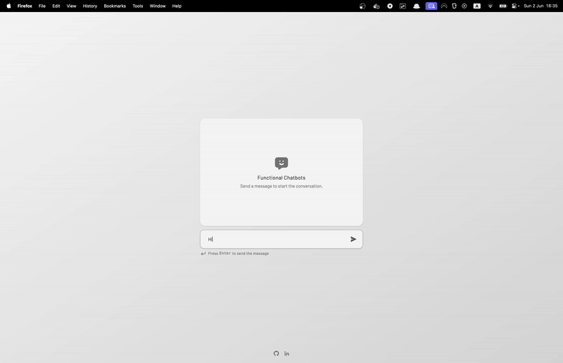

# ~~Task 1: Integrate the LLM within the htmx chat~~

Congrats! You've successfully integrated the LLM within the htmx chat. 🎉



You now have a basic chat application that can generate responses using LLama 3.

# Next Steps

But that's not too impressive, is it? Let's see what else we can do.

Switch to the `3-client-events-task` branch to see the next task.
```bash
git switch 3-client-events-task
```