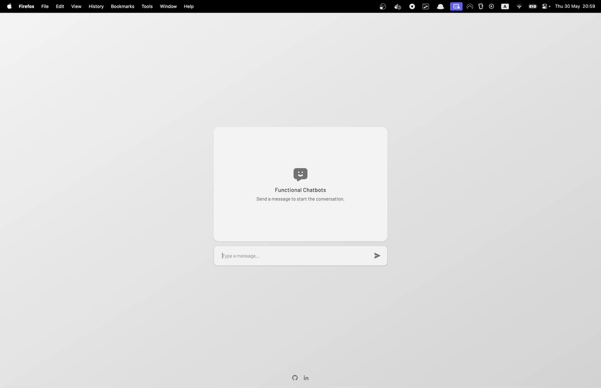

# Task 1: Integrate the LLM within the htmx chat



You see a chat window, and you can send messages. However, nobody is answering. Let's change that.

You have `TODO`s in the following files:
1. `functional_chatbots/views.py` 
2. `functional_chatbots/templates/pages/index.html`

They include `Notes` & `Hints` to help you.

After you're done, you should see the assistant responding to your messages.

You have **10 minutes**. Good luck! 🚀

# Next Steps

Switch to the `2-integrate-llm-solution` branch to see the solution.
```bash
git switch 2-integrate-llm-solution
```